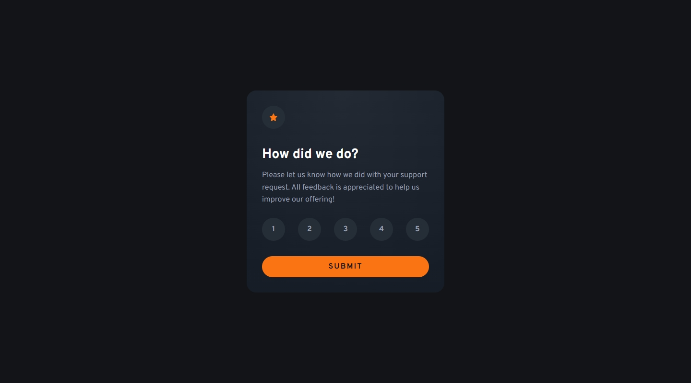
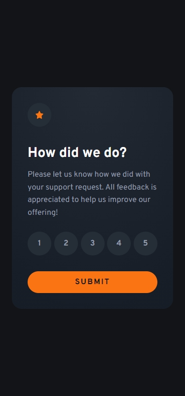

## Frontend Mentor Challenge 20 - Workit Landing Page

This is my solution to the [Interactive Rating Component](https://www.frontendmentor.io/challenges/interactive-rating-component-koxpeBUmI) challenge on [Frontend Mentor](https://www.frontendmentor.io/).

#

### Links. 🔗

- Live Site URL: https://interactive-rating-component-darkstarxdd.vercel.app/

#

### Screenshots of the Solution (Desktop & Mobile). 🔍




#

### Built with. 🔨

- HTML & CSS.
- JavaScript.
- Vite.

#

### Features. ✨

- Display a custom error message if a rating is not selected when submitting.

#

### New Things Learned. 🎓

- Custom styling radio buttons.
- `attr()` CSS function - _Used to retrieve the value of an attribute of the selected element and use it in the stylesheet._ - [MDN](https://developer.mozilla.org/en-US/docs/Web/CSS/attr)
- Next-sibling combinator (`+`) - _Matches the second element only if it immediately follows the first element._ - [MDN](https://developer.mozilla.org/en-US/docs/Web/CSS/Next-sibling_combinator)

#

### Problems Faced. 🚧

- The main problem was how to make the radio buttons look like the design. After searching and playing around for sometime I had two methods.

  - Method 1: Visually-hide the radio button and style the _label_ to look like the radio button. Based on the radio button's focused or checked state, the label can be styled.

    ```css
    .radio-button:focus-visible + .radio-label {
      outline: 0.125rem dotted var(--clr-primary-400);
      outline-offset: 0.125rem;
    }

    .radio-button:checked + .radio-label {
      color: var(--clr-primary-600);
      background-color: var(--clr-primary-400);
    }
    ```

  - Method 2: Visually-hide the label and style the _radio button_ to get the desired look. With this approach I had to use an absolutely positioned pseudo element to display the number in the middle of each radio button.
    ```css
    .radio-button::after {
      content: attr(value);
      position: absolute;
      top: 50%;
      left: 50%;
      transform: translate(-50%, -50%);
    }
    ```

- I ended up using the first method.

#

### Testing and Accessibility. 🧪

- Tested site usability with keyboard-only navigation.
- Used the Responsively App to check the site's appearance on various screen sizes, from 320x480 to 3000x2000.
- Set the browser font size on desktop to various values ranging from 9px to 72px to ensure everything on the site scales properly with the user's preferred browser font size.
- Zoomed the page in and out using Ctrl + Scroll wheel (up to 500%).
- Tested with the NVDA screen reader.
- Viewed the site on an iPhone 11 in both portrait and landscape modes.
- Performed Lighthouse and PageSpeed tests. ([PageSpeed Result.](https://pagespeed.web.dev/analysis/https-interactive-rating-component-darkstarxdd-vercel-app/lbtbvmugjk?form_factor=mobile))

#

### Tools I Use. 🔧

- [Prettier VS Code Extension](https://marketplace.visualstudio.com/items?itemName=esbenp.prettier-vscode) - Code formatter.

- [Responsively.app](https://responsively.app/) - A free and open source tool that allows you to test your webpage on different screen sizes, take screenshots and much more.

- [Color Contrast Checker by coolors.co](https://coolors.co/contrast-checker/112a46-acc8e5) - Check color contrast ratios and if needed, update the colors to match the WCAG guidelines.

- [Google Webfonts Helper by Mario Ranftl](https://gwfh.mranftl.com/fonts) - Provides WOFF2 format for Google Fonts.

#

- My Frontend Mentor Profile - [@DarkstarXDD](https://www.frontendmentor.io/profile/DarkstarXDD)
